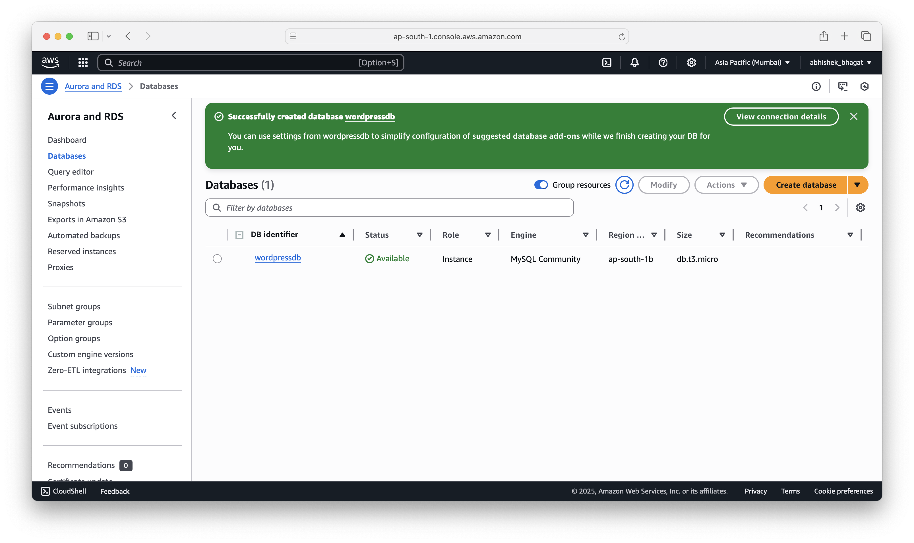
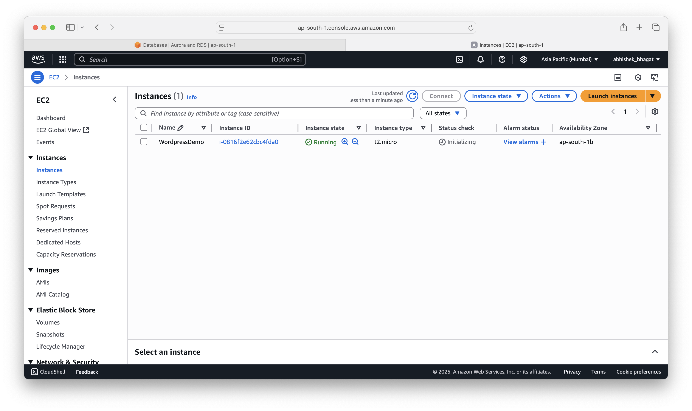

# 🖥️ WordPress Deployment on AWS EC2 with Amazon RDS

This project demonstrates a complete deployment of **WordPress** on an **Amazon EC2 instance**, using an **Amazon RDS MySQL** database for persistent backend storage. The goal was to fully decouple application and database layers, following a secure and scalable AWS architecture.

---

## 🧱 Architecture Overview

- **Amazon EC2**: Hosts WordPress + Apache + PHP
- **Amazon RDS (MySQL)**: Stores WordPress data
- **Security Groups**: Controls access between EC2 and RDS
- **Manual Configuration**: No automated tools—pure CLI & manual provisioning

---

## ⚙️ AWS Services Used

| Service          | Purpose                                   |
|------------------|-------------------------------------------|
| EC2              | Runs Apache, PHP, WordPress               |
| RDS (MySQL)      | External database for WordPress           |
| Security Groups  | Restrict MySQL traffic to EC2 only        |
| IAM (Optional)   | Used default permissions for this setup   |

---

## ✅ Deployment Steps

### 1️⃣ Create RDS Instance

- Choose **MySQL** engine
- Disable public access
- Create **DB name**, **username**, **password**
- Create custom **security group** for RDS



---

### 2️⃣ Launch EC2 Instance

- Amazon Linux 2023, `t2.micro`
- Open ports: **22** (SSH), **80** (HTTP)
- Allow EC2 security group **inbound to RDS port 3306**



---

### 3️⃣ Connect EC2 to RDS (MySQL Client)

```bash
sudo yum update -y
sudo yum install mysql -y
```

- Verify RDS connection:

```bash
mysql -h <RDS-ENDPOINT> -u <dbuser> -p
```

- Create the required database and WordPress user:

```sql
CREATE DATABASE wordpressdb;
CREATE USER 'wpuser'@'%' IDENTIFIED BY 'password';
GRANT ALL PRIVILEGES ON wordpressdb.* TO 'wpuser'@'%';
FLUSH PRIVILEGES;
```

---

### 4️⃣ Install Apache + PHP on EC2

```bash
sudo yum install httpd php php-mysqlnd php-fpm php-json -y
sudo systemctl enable httpd
sudo systemctl start httpd
```

---

### 5️⃣ Install WordPress

```bash
wget https://wordpress.org/latest.tar.gz
tar -xzf latest.tar.gz
sudo cp -r wordpress/* /var/www/html/
sudo chown -R apache:apache /var/www/html/
```

---

### 6️⃣ Configure WordPress to Use RDS

- Edit `wp-config.php` in `/var/www/html/`:

```php
define('DB_NAME', 'wordpressdb');
define('DB_USER', 'wpuser');
define('DB_PASSWORD', 'password');
define('DB_HOST', '<your-rds-endpoint>:3306');
```

---

### 7️⃣ Deploy and Verify

- Access the EC2 public IP in your browser:  
    `http://<EC2_PUBLIC_IP>`
- WordPress installation screen should appear ✅

---

## 🚀 Future Enhancements

- Use Route 53 + HTTPS via SSL/TLS for domain security.
- Store media in Amazon S3.
- Use Auto Scaling Group + Load Balancer for high availability.

---

## 👤 About Me

I’m Abhishek Bhagat, a Cloud & DevOps Engineer, building full-stack applications on AWS to sharpen my deployment and automation skills.

> “Decoupling application and database layers is not just best practice-it’s scalability by design.”

---

## 📄 Project Documentation

- [📎 WordPress Deployment on EC2 with Amazon RDS (MySQL).pdf](./WordPress%20Deployment%20on%20EC2%20with%20Amazon%20RDS%20(MySQL).pdf)

## 📎 Reference

- [WordPress Official Documentation](https://wordpress.org/support/article/how-to-install-wordpress/)